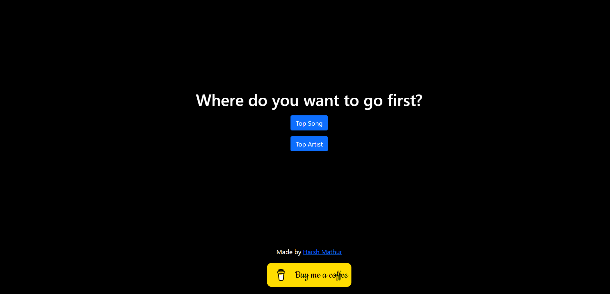

# Crescendo
A web app that displays your spotify top artist and top song in the form of a tweet

Deployed live at https://crescendo.up.railway.app/





# To run the app locally
1. Create a `.env` file
2. Get your CLIENT_ID and CLIENT_SECRET from https://developer.spotify.com/
3. run the command 
```
npm install
nodemon app.js
```


# Tech Stack
Made using HTML, CSS, EJS, Node.js, Express JS

# To collaborate
1. Fork the repo
2. Make changes in a seperate branch 
3. Make a PR to the `master` branch 
